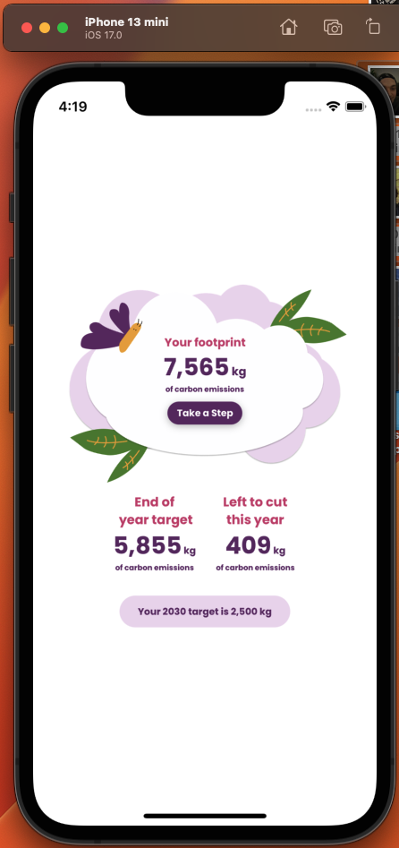

# Giki tech test

Tech test to replicate the given screen `./assets/readme/visual.jpeg`


Here is my finished screen on iphone 15 max...


Here is my finished screen on iphone 13 mini...




## Project setup

Ensure you have Expo CLI installed along with an appropriate simulator, or ExpoGo on a personal device connected to the same network as your machine.

Clone this repo and `cd` into the root directory. Once there...
```
npm install
expo start
```
Follow the prompts to load the app onto your chosen device.

Revel in its beauty.

### Dependencies
- react-native-svg
- react-native-testing-library
- react-native-size-matters
